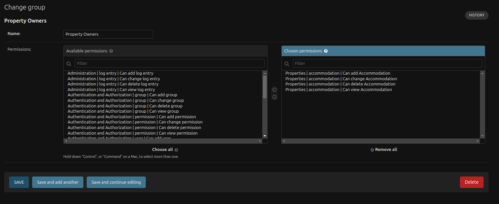
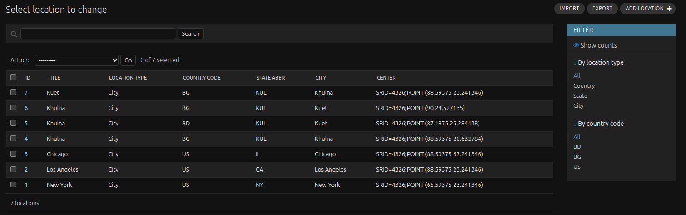

# W3-Assignment-Django-Database
## Project Setup
**Clone The Git Repo**
```
git clone https://github.com/Chy-Zaber-Bin-Zahid/W3-Assignment-Django-Database.git
```
**Change Directory To `W3-Assignment-Django-Database`**
```
cd W3-Assignment-Django-Database
```
**Create An Venv**
```
python3 -m venv env
```
**Activate The Venv**
```
source env/bin/activate
```
**Change Directory To `Inventory_Management`**
```
cd Inventory_Management
```
**Shut Down If Any Previous Containers Are Running In Your Docker**
```
docker-compose down
```
**Build And Run The Docker**
```
docker-compose up --build
```
**Update The Model Using The Below Commands**
```
docker exec -it inventory_management python manage.py makemigrations
```
```
docker exec -it inventory_management python manage.py migrate
```
**Create Super User**
```
docker exec -it inventory_management python manage.py createsuperuser
```

## Property Owners Creation
Go to django admin dashboard `http://127.0.0.1:8000/admin/` and login as admin. Click on `Groups Add+` button and create a `Property Owners` group and gave this four permission showing in the image below and click the save option.



## Sign Up Request

Go to this url `http://127.0.0.1:8000` and create an account. After creating account you will be redirect to login page of django admin.

## Testing Using Pytest
**Run The Following Command From `Inventory_Management` Directory
```
docker exec -it inventory_management pytest --cov=properties --cov-report=term-missing
```

## Sitemap Generation
**Run The Following Command From `Inventory_Management` Directory
```
docker-compose exec web python manage.py generate_sitemap
```
A `sitemap.json` file will be created after executing the command line.

## Import Location Data Via CSV
Go to django admin dashboard `http://127.0.0.1:8000/admin/` and login as admin. Click on `Locations` table. Click on the import button on top right as shown in the image below and select a csv file and import it to locations table.

